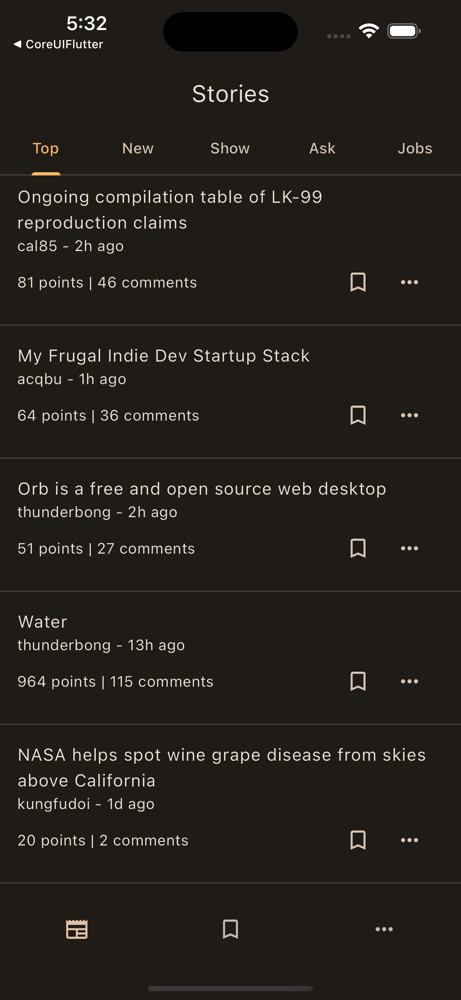
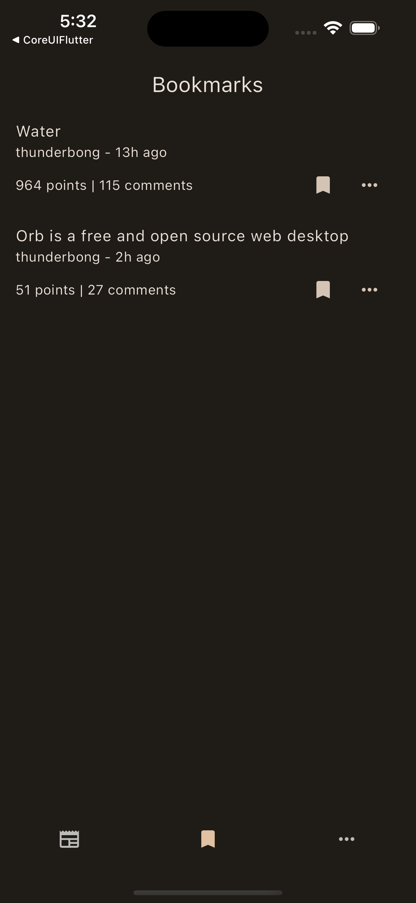
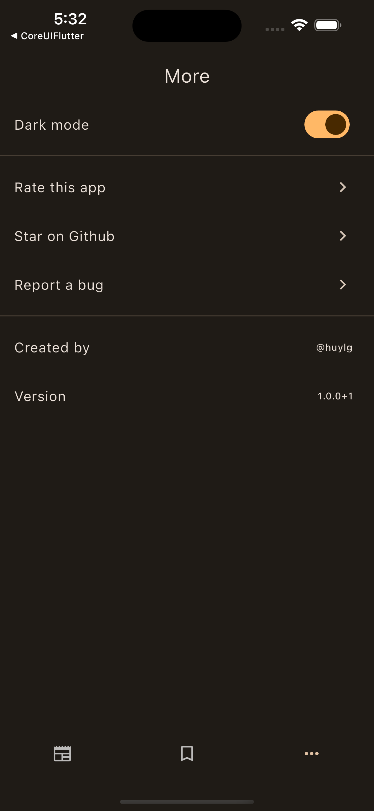

### App Screenshots

    
    
    

## Description

The Hacker News Flutter Client App is a mobile application built with Flutter, designed to browse and interact with Hacker News. It enables users to read the latest news, view comments, bookmark interesting stories, and share them with others.

## Features

- Browse the latest Hacker News stories: Access the most up-to-date and trending stories from the Hacker News community.
- View story details and comments: Dive deep into a story to read its details and explore the user comments.
- Dark mode support: Enjoy a comfortable reading experience in low-light conditions with the dark mode feature.
- Bookmark and share New: Save interesting stories to your bookmarks and easily share them with your friends and colleagues.

## Packages

- provider: State management library that helps manage app-wide state and updates.
- gorouter: Lightweight and easy-to-use navigation package to handle app routing.
- freezed: Automatically generates models with a focus on immutability and equality checks.
- share_plus: Allows users to share news articles with other apps on their devices.
- shared_preferences: Provides local storage to save bookmarks.
- url_launcher: Enables opening URLs in the default browser for reading full articles.
_ material 3: New designed system.

## Development

To run the app locally, run command: `flutter run`

## Hackernews API

[https://github.com/HackerNews/API](https://github.com/HackerNews/API)
